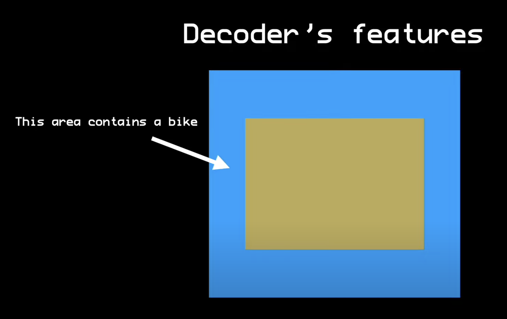
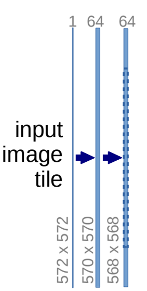
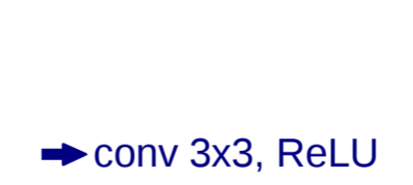
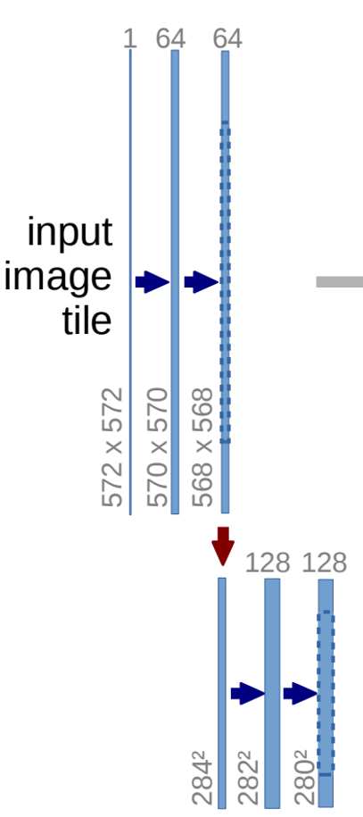
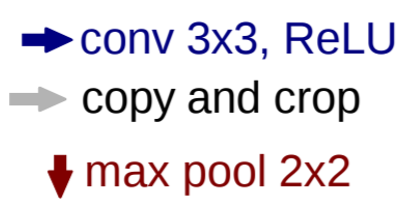
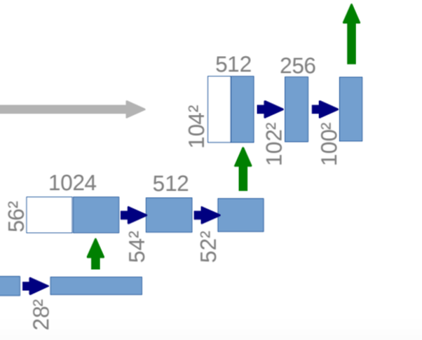
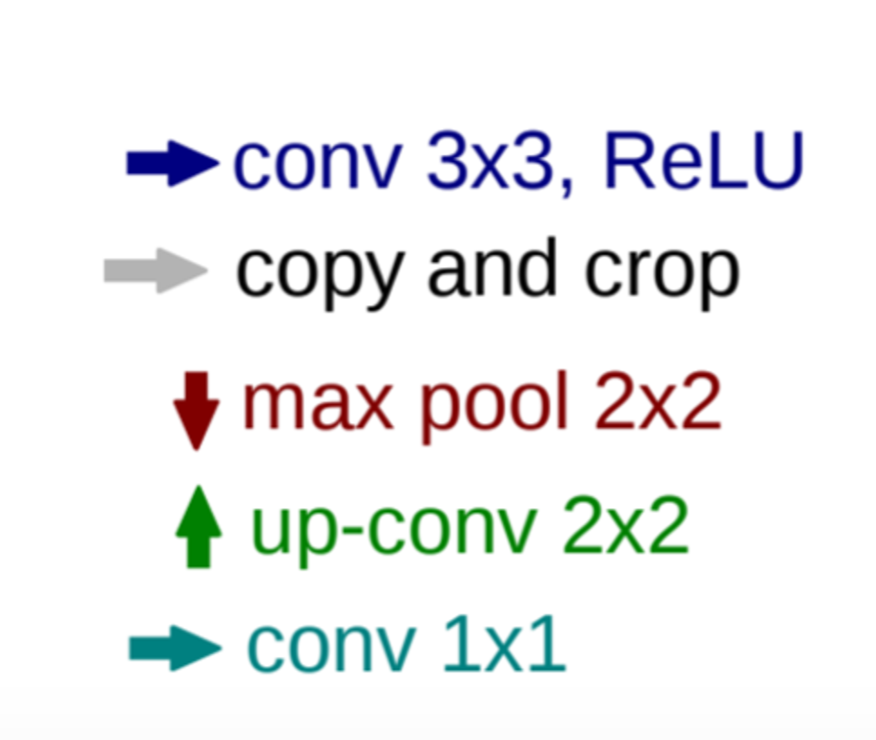

# UNet 네트워크 구현

### **[ UNet 구조 ]**

전체적인 구조를 이해하면, 코드 작성에 유리해!

→ [https://www.youtube.com/watch?v=NhdzGfB1q74](https://www.youtube.com/watch?v=NhdzGfB1q74) 4:50-5:30 , 7:00-

encoder - decoder , connections




- UNet 모델의 구조를 보고, 코드를 하나씩 매칭해 가며 구현

### Layer 생성하기

---

```python
# convolution, batch normalization, ReLU Layer
def CBR2d(in_channels, out_channels, kernel_size=3, stride=1, padding=1, bias=True):
    layers = []
    # convolution layer 정의
    layers += [nn.Conv2d(in_channels=in_channels, out_channels=out_channels, 
                        kernel_size=kernel_size, stride=stride, padding=padding, 
                        bias = bias)]
    # batch normalization layer
    layers += [nn.BatchNorm2d(num_features=out_channels)]
    # ReLU Layer
    layers += [nn.ReLU()]

    cbr = nn.Sequential(*layers)

    return cbr
```

```python
self.encoder1_1 = CBR2d(in_channels=1, out_channels=64)  
self.encoder1_2 = CBR2d(in_channels=64, out_channels=64)
```





---

```python
self.pool1 = nn.MaxPool2d(kernel_size=2)
```

- Encoder Block

```python
self.encoder1_1 = CBR2d(in_channels=1, out_channels=64)  
self.encoder1_2 = CBR2d(in_channels=64, out_channels=64)

self.pool1 = nn.MaxPool2d(kernel_size=2)
```





---

```python
self.unpool4 = nn.ConvTranspose2d(in_channels=512, out_channels=512, kernel_size=2, stride=2, padding=0, bias=True)
```

- Decoder Block

```python
self.unpool4 = nn.ConvTranspose2d(in_channels=512, out_channels=512, kernel_size=2, stride=2, padding=0, bias=True)

# concat 주의!
self.decoder4_2 = CBR2d(in_channels= 2 * 512, out_channels=512)
self.decoder4_1 = CBR2d(in_channels=512, out_channels=256)
```





```python
# conv 1x1
self.fc = nn.Conv2d(in_channels=64, out_channels=1, kernel_size=1, stride=1, padding=0, bias=True)
```

---

위를 정리하면…..

```python
    # unet을 정의하는 데 필요한 layer 선언
    def __init__(self):
        super(UNet, self).__init__()
    
        # convolution, batch normalization, ReLU Layer
        def CBR2d(in_channels, out_channels, kernel_size=3, stride=1, padding=1, bias=True):
            layers = []
            # convolution layer 정의
            layers += [nn.Conv2d(in_channels=in_channels, out_channels=out_channels, 
                                kernel_size=kernel_size, stride=stride, padding=padding, 
                                bias = bias)]
            # batch normalization layer
            layers += [nn.BatchNorm2d(num_features=out_channels)]
            # ReLU Layer
            layers += [nn.ReLU()]

            cbr = nn.Sequential(*layers)

            return cbr
		    # encode
        # contracting path
        self.encoder1_1 = CBR2d(in_channels=1, out_channels=64)  
        self.encoder1_2 = CBR2d(in_channels=64, out_channels=64)

        self.pool1 = nn.MaxPool2d(kernel_size=2)

        self.encoder2_1 = CBR2d(in_channels=64, out_channels=128)
        self.encoder2_2 = CBR2d(in_channels=128, out_channels=128)

        self.pool2 = nn.MaxPool2d(kernel_size=2)
        
        self.encoder3_1 = CBR2d(in_channels=128, out_channels=256)
        self.encoder3_2 = CBR2d(in_channels=256, out_channels=256)

        self.pool3 = nn.MaxPool2d(kernel_size=2)
        
        self.encoder4_1 = CBR2d(in_channels=256, out_channels=512)
        self.encoder4_2 = CBR2d(in_channels=512, out_channels=512)

        self.pool4 = nn.MaxPool2d(kernel_size=2)
        
        self.encoder5_1 = CBR2d(in_channels=512, out_channels=1024)

        # expansive path
        self.decoder5_1 = CBR2d(in_channels=1024, out_channels=512)

        self.unpool4 = nn.ConvTranspose2d(in_channels=512, out_channels=512, kernel_size=2, stride=2, padding=0, bias=True)

        self.decoder4_2 = CBR2d(in_channels= 2 * 512, out_channels=512)
        self.decoder4_1 = CBR2d(in_channels=512, out_channels=256)
        
        self.unpool3 = nn.ConvTranspose2d(in_channels=256, out_channels=256, kernel_size=2, stride=2, padding=0, bias=True)

        self.decoder3_2 = CBR2d(in_channels=2 * 256, out_channels=256)
        self.decoder3_1 = CBR2d(in_channels=256, out_channels=128)
        
        self.unpool2 = nn.ConvTranspose2d(in_channels=128, out_channels=128, kernel_size=2, stride=2, padding=0, bias=True)
        
        self.decoder2_2 = CBR2d(in_channels=2 * 128, out_channels=128)
        self.decoder2_1 = CBR2d(in_channels=128, out_channels=64)
        
        self.unpool1 = nn.ConvTranspose2d(in_channels=64, out_channels=64, kernel_size=2, stride=2, padding=0, bias=True)

        self.decoder1_2 = CBR2d(in_channels=2 * 64, out_channels=64)
        self.decoder1_1 = CBR2d(in_channels=64, out_channels=64)
        
        self.fc = nn.Conv2d(in_channels=64, out_channels=1, kernel_size=1, stride=1, padding=0, bias=True)
```

---

### Layer 연결하기

```python
# forward func -> init 에서 생성한 layer를 연결하는 코드 작성, x: input img
def forward(self, x):
    # encoder part
    encoder1_1 = self.encoder1_1(x)
    encoder1_2 = self.encoder1_2(encoder1_1)
    pool1 = self.pool1(encoder1_2)

    encoder2_1 = self.encoder2_1(pool1)
    encoder2_2 = self.encoder2_2(encoder2_1)
    pool2 = self.pool2(encoder2_2)
		
		...

    encoder5_1 = self.encoder5_1(pool4)

    # decoder part        
    decoder5_1 = self.decoder6_1(encoder5_1)

    unpool4 = self.unpool4(decoder5_1)
    concat4 = torch.cat((unpool4, encoder4_2), dim=1)
    decoder4_2 = self.decoder4_2(concat4)
    decoder4_1 = self.decoder4_1(decoder4_2)

    unpool3 = self.unpool3(decoder4_1)
    concat3 = torch.cat((unpool3, encoder3_2), dim=1)
    decoder3_2 = self.decoder3_2(concat3)
    decoder3_1 = self.decoder3_1(decoder3_2)

    ...

    x = self.fc(decoder1_1)

    return x
```

---

### 완성된 UNet 네트워크 구현 코드

```python
class UNet(nn.Module):
    # unet을 정의하는 데 필요한 layer 선언
    def __init__(self):
        super(UNet, self).__init__()
    
        # convolution, batch normalization, ReLU Layer
        def CBR2d(in_channels, out_channels, kernel_size=3, stride=1, padding=1, bias=True):
            layers = []
            # convolution layer 정의
            layers += [nn.Conv2d(in_channels=in_channels, out_channels=out_channels, 
                                kernel_size=kernel_size, stride=stride, padding=padding, 
                                bias = bias)]
            # batch normalization layer
            layers += [nn.BatchNorm2d(num_features=out_channels)]
            # ReLU Layer
            layers += [nn.ReLU()]

            cbr = nn.Sequential(*layers)

            return cbr
		    # encode
        # contracting path
        self.encoder1_1 = CBR2d(in_channels=1, out_channels=64)  
        self.encoder1_2 = CBR2d(in_channels=64, out_channels=64)

        self.pool1 = nn.MaxPool2d(kernel_size=2)

        self.encoder2_1 = CBR2d(in_channels=64, out_channels=128)
        self.encoder2_2 = CBR2d(in_channels=128, out_channels=128)

        self.pool2 = nn.MaxPool2d(kernel_size=2)
        
        self.encoder3_1 = CBR2d(in_channels=128, out_channels=256)
        self.encoder3_2 = CBR2d(in_channels=256, out_channels=256)

        self.pool3 = nn.MaxPool2d(kernel_size=2)
        
        self.encoder4_1 = CBR2d(in_channels=256, out_channels=512)
        self.encoder4_2 = CBR2d(in_channels=512, out_channels=512)

        self.pool4 = nn.MaxPool2d(kernel_size=2)
        
        self.encoder5_1 = CBR2d(in_channels=512, out_channels=1024)

        # expansive path
        self.decoder5_1 = CBR2d(in_channels=1024, out_channels=512)

        self.unpool4 = nn.ConvTranspose2d(in_channels=512, out_channels=512, kernel_size=2, stride=2, padding=0, bias=True)

        self.decoder4_2 = CBR2d(in_channels= 2 * 512, out_channels=512)
        self.decoder4_1 = CBR2d(in_channels=512, out_channels=256)
        
        self.unpool3 = nn.ConvTranspose2d(in_channels=256, out_channels=256, kernel_size=2, stride=2, padding=0, bias=True)

        self.decoder3_2 = CBR2d(in_channels=2 * 256, out_channels=256)
        self.decoder3_1 = CBR2d(in_channels=256, out_channels=128)
        
        self.unpool2 = nn.ConvTranspose2d(in_channels=128, out_channels=128, kernel_size=2, stride=2, padding=0, bias=True)
        
        self.decoder2_2 = CBR2d(in_channels=2 * 128, out_channels=128)
        self.decoder2_1 = CBR2d(in_channels=128, out_channels=64)
        
        self.unpool1 = nn.ConvTranspose2d(in_channels=64, out_channels=64, kernel_size=2, stride=2, padding=0, bias=True)

        self.decoder1_2 = CBR2d(in_channels=2 * 64, out_channels=64)
        self.decoder1_1 = CBR2d(in_channels=64, out_channels=64)
        
        self.fc = nn.Conv2d(in_channels=64, out_channels=1, kernel_size=1, stride=1, padding=0, bias=True)

    # unet layer 연결하기
    # forward func -> init 에서 생성한 layer를 연결하는 코드 작성, x: input img
    def forward(self, x):
        # encoder part
        encoder1_1 = self.encoder1_1(x)
        encoder1_2 = self.encoder1_2(encoder1_1)
        pool1 = self.pool1(encoder1_2)

        encoder2_1 = self.encoder2_1(pool1)
        encoder2_2 = self.encoder2_2(encoder2_1)
        pool2 = self.pool2(encoder2_2)
        
        encoder3_1 = self.encoder3_1(pool2)
        encoder3_2 = self.encoder3_2(encoder3_1)
        pool3 = self.pool3(encoder3_2)

        encoder4_1 = self.encoder4_1(pool3)
        encoder4_2 = self.encoder4_2(encoder4_1)
        pool4 = self.pool4(encoder4_2)

        encoder5_1 = self.encoder5_1(pool4)

        # decoder part        
        decoder5_1 = self.decoder5_1(encoder5_1)

        unpool4 = self.unpool4(decoder5_1)
        concat4 = torch.cat((unpool4, encoder4_2), dim=1)
        decoder4_2 = self.decoder4_2(concat4)
        decoder4_1 = self.decoder4_1(decoder4_2)

        unpool3 = self.unpool3(decoder4_1)
        concat3 = torch.cat((unpool3, encoder3_2), dim=1)
        decoder3_2 = self.decoder3_2(concat3)
        decoder3_1 = self.decoder3_1(decoder3_2)

        unpool2 = self.unpool2(decoder3_1)
        concat2 = torch.cat((unpool2, encoder2_2), dim=1)
        decoder2_2 = self.decoder2_2(concat2)
        decoder2_1 = self.decoder2_1(decoder2_2)

        unpool1 = self.unpool1(decoder2_1)
        concat1 = torch.cat((unpool1, encoder1_2), dim=1)
        decoder1_2 = self.decoder1_2(concat1)
        decoder1_1 = self.decoder1_1(decoder1_2)

        x = self.fc(decoder1_1)

        return x
```

---

### Refactoring

```jsx
from torch.utils.tensorboard import SumaryWriter

# UNet Model
class UNet(nn.Module):
    def __init__(self):
        super(UNet, self).__init__()

        # convolution, batch normalization, ReLU Layer
        def CBR2d(in_channels, out_channels, kernel_size=3, stride=1, padding=1, bias=True):
            return nn.Sequential(
                nn.Conv2d(in_channels, out_channels, kernel_size, stride, padding, bias),
                nn.BatchNorm2d(out_channels),
                nn.ReLU(inplace=True)
            )

        def EncoderBlock(in_channels, out_channels):
            return nn.Sequential(
                CBR2d(in_channels, out_channels),
                CBR2d(out_channels, out_channels),
                nn.MaxPool2d(kernel_size=2)
            )

        class DecoderBlock(nn.Module):
            def __init__(self, in_channels, mid_channels, out_channels):
                super(DecoderBlock, self).__init__()
                self.upconv = nn.ConvTranspose2d(in_channels, mid_channels, kernel_size=2, stride=2)
                self.conv1 = CBR2d(mid_channels + out_channels, mid_channels)  # concat 후의 특징 맵 수를 고려
                self.conv2 = CBR2d(mid_channels, out_channels)

            def forward(self, x, concat_with):
                x = self.upconv(x)
                x = torch.cat((x, concat_with), dim=1)
                x = self.conv1(x)
                x = self.conv2(x)
                return x

        self.encoder1 = EncoderBlock(1, 64)
        self.encoder2 = EncoderBlock(64, 128)
        self.encoder3 = EncoderBlock(128, 256)
        self.encoder4 = EncoderBlock(256, 512)
        
        self.bottleneck = nn.Sequential(
            CBR2d(512, 1024),
            CBR2d(1024, 1024)
        )
        
        self.decoder4 = DecoderBlock(1024, 512, 512)
        self.decoder3 = DecoderBlock(512, 256, 256)
        self.decoder2 = DecoderBlock(256, 128, 128)
        self.decoder1 = DecoderBlock(128, 64, 64)

        self.final_conv = nn.Conv2d(64, 1, kernel_size=1, stride=1, padding=0, bias=True)

        self._initialize_weights()

    def forward(self, x):
        enc1 = self.encoder1(x)
        enc2 = self.encoder2(enc1)
        enc3 = self.encoder3(enc2)
        enc4 = self.encoder4(enc3)

        bottleneck = self.bottleneck(enc4)
				
        dec4 = self.decoder4(bottleneck, enc4)
        dec3 = self.decoder3(dec4, enc3)
        dec2 = self.decoder2(dec3, enc2)
        dec1 = self.decoder1(dec2, enc1)

        out = self.final_conv(dec1)

        return out
```

---

<aside>
🔗 참고 자료
[https://arxiv.org/abs/1505.04597](https://arxiv.org/abs/1505.04597)
[https://www.youtube.com/watch?v=sSxdQq9CCx0&t=265s](https://www.youtube.com/watch?v=sSxdQq9CCx0&t=265s)
[https://dacon.io/codeshare/4245](https://dacon.io/codeshare/4245)

</aside>

---

Bias


conv 연산이 출력하는 feature map에 학습가능한 bias를 추가 (기본적으로 True).

[https://pytorch.org/docs/stable/generated/torch.nn.Conv2d.html#torch.nn.Conv2d](https://pytorch.org/docs/stable/generated/torch.nn.Conv2d.html#torch.nn.Conv2d)

---

copy & crop → 중안부를 crop해서 concat.? encoding decoding 방법이랑 같다고 하는데에,,

copy할 때, 중간 부분을 알맞은 사이즈로 cropping해서 보냄. convolution을 하면서 가장자리 픽셀에 대한 정보가 손실되는 것에 대한 양쪽의 보정…?

---

sliding X

Unet patch 탐색 방식 → 검증 끝난 곳은 다시 보지 않음.

unet 같은 경우, ㅡ일반적으로 padding 수행하지 않고, convolution 수행 : 출력 크기가 입력 크기보다 작아

- 매번 네트워크 이전에 크기를 줄이고 네트워크를 따라 업샘플링하는 방식(시간과 노력 많이 듦)을 사용하지 않고, 오버랩 타일이라는 전략 사용, 9분 30[https://youtu.be/O_7mR4H9WLk?si=x3zIuCOvkukfpN-V](https://youtu.be/O_7mR4H9WLk?si=x3zIuCOvkukfpN-V)
- 그래서 보통 zero padding을 덧붙여서 출력 크기를 맞춰준다. → 찾아보기

---

- unet stochastic grad desc.  이용해 학습 batch 사이즈를 크게하여 학습시키는 것 보다 input tile → patch 의 사이즈 크게줌 batch size 작게 하면 학습에 있어서 최적화가 잘안되고 여러개를 보지 못하니까 이를 보완하기 위해 momentum 을 0.99라는 값으로 크게 줘서 과거의 값들이 많이 반영되어 학습되도록 구성함.

---

pixel-wise Loss를 이용해 세포 경계선 학습 시킴 

cell인 경우 아닌 경우